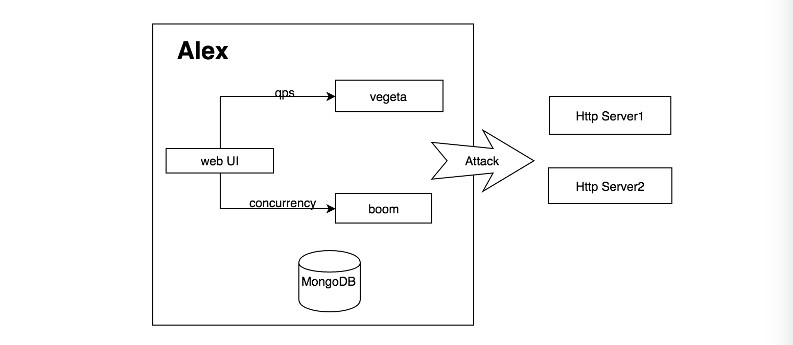
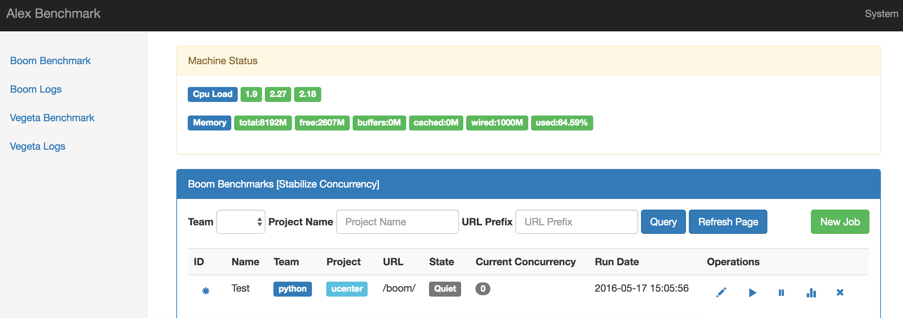
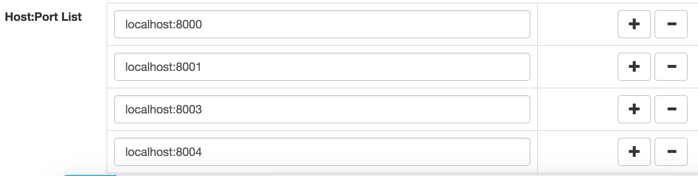
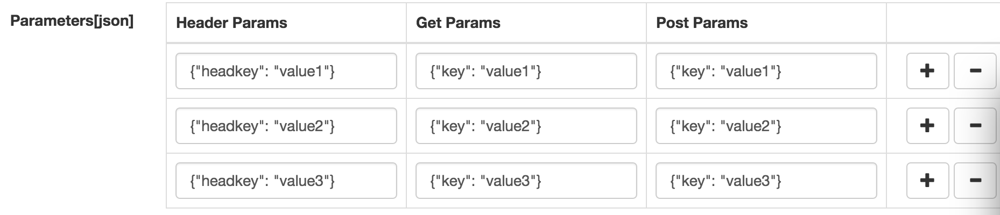
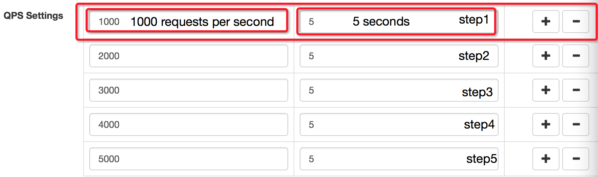
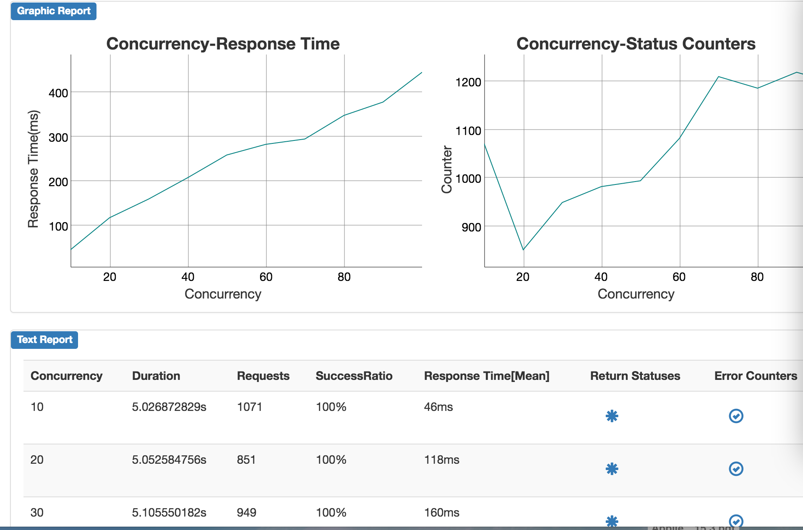

Alex
=================
Alex是基于vegeta library和boom封装的压力测试web UI。Vegeta提供稳定的qps压力源，boom提供稳定的并发数压力源。

[English](README_en.md)

Alex架构图
-----------------


Alex 主要功能
-----------------------------------
1. 保存压力测试参数以便反复压测
2. 保存压力测试报告以便后续查看和分享
3. 提供了简单直接的图形和文字报告
4. 可以同时对多个http接口进行压力测试
5. 可以同时对集群内多个host:port对进行压测
6. 使用多组调用参数避免压测时出现的数据热点问题
7. 使用步骤设置，生成渐进式的压力源
8. 提供简单的压测机器系统状态实时显示功能

Alex Limitations
-----------------------------------
1. Alex运行在单一进程里，如果你需要分布式的压测环境，就得部署多个节点，压测时需要多人同时操作。
2. Vegeta在压力过载时没有提供立即停止的方法。这就需要你细心设计压测步骤，仔细观察系统状态避免系统过载。
3. Qps和并发数不宜过大。我曾经使用Alex工具单进程测试了HelloWorld的web程序每个请求吐出1500字节，qps最多可以达到60000，基本让千兆网卡打满。
4. 在大型压力测试下，尽量避免Gzip解压缩。解压缩会消耗大量的cpu资源，会导致压测报告不准确。你可以通过部署多个节点来进行大型压力测试。
5. 只支持Http协议。Https协议不打算支持，因为加密解密也同样会消耗大量cpu资源，导致报告不准确。
6. 报告只是提供一种性能参考，要勇于对报告进行质疑。
7. Alex虽然有如此诸多限制，这不影响它的日常使用。

安装
----------------------------------
```
install mongodb
install golang  # 1.4+ is required

go get -u github.com/golang/dep/cmd/dep # install dep
go get github.com/ireaderlab/alex # install alex

cd $GOPATH/src/github.com/ireaderlab/alex
dep ensure
go build
./alex
./alex -c config.json

open browser
http://localhost:8000/

```

配置config.json
---------------------------
```
{
    "BindAddr": "localhost:8000",
    "MongoUrl": "mongodb://localhost:27017/alex",
    "Teams": [
        "python",
        "java",
        "php",
        "go"
    ]
}

```

引用
-----------------------------
1. 棒棒的vegeta https://github.com/tsenart/vegeta
2. 简单直接的boom https://github.com/rakyll/boom

截屏
-----------------------------






注意
-----------------------------
Alex工具非常简单，近期也不会对Alex做出大的修改
如果有小的bug或者建议，请告知我，我会第一时间修复。


